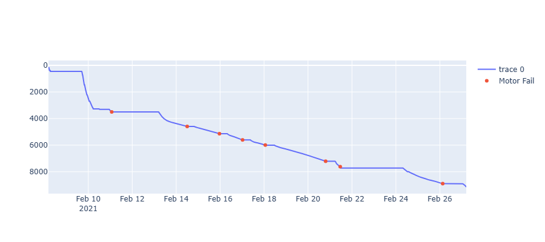
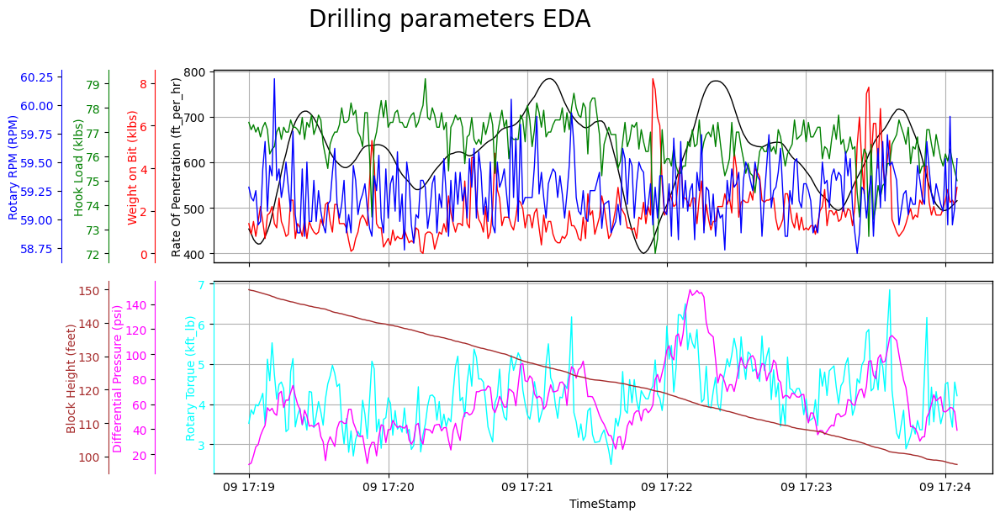
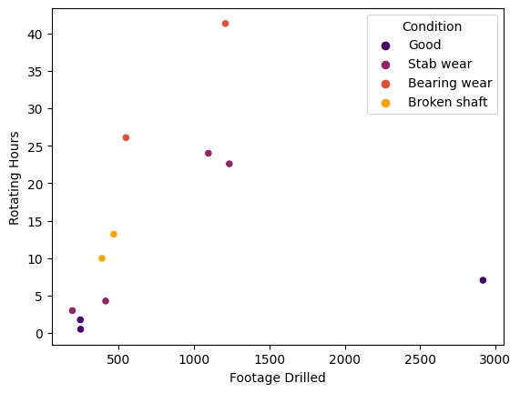
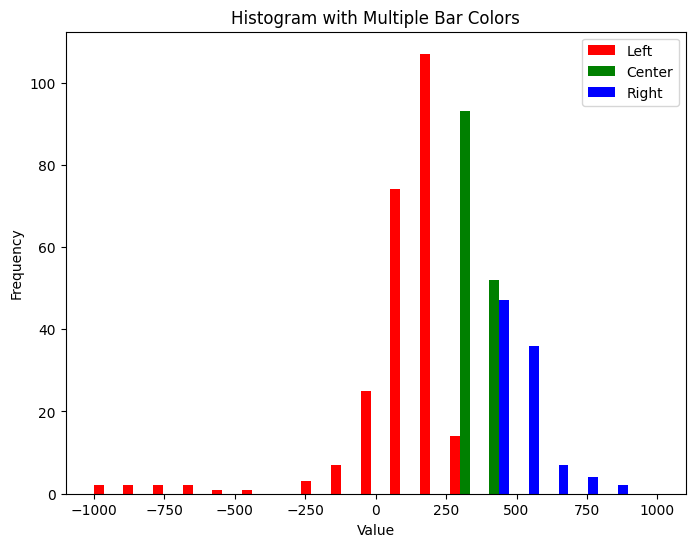
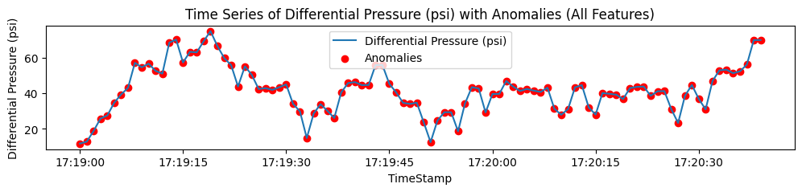

# Downhole Motor Failure Prediction & Anomaly Analytics

_Points of Motor Fail along the well depth and time of occurrence_

## Overview

**Downhole motors**—especially positive displacement mud motors (PDMs)—are essential in directional drilling, enabling trajectory control and bit steering in complex formations. However, their performance is highly sensitive to mechanical and hydraulic stressors, such as fluctuating torque, stick-slip, pressure surges, and poor hole cleaning. These stressors, if unmonitored, culminate in **premature wear, stall events, or outright motor failure**, leading to non-productive time (NPT) and costly interventions.

This project presents an **end-to-end data-driven pipeline** for analyzing, modeling, and predicting downhole motor failure using high-resolution surface telemetry and motor metadata. The core objective is to demonstrate how a fusion of **engineering intuition** and **machine learning** can lead to intelligent early warning systems and deeper operational insight in drilling optimization.

---

## Key Highlights

- **Multivariate anomaly detection** on differential pressure and torque signals.
- **Depth-synchronized merging** of real-time telemetry with motor failure logs.
- **Stall detection framework** based on torque-pressure-flow interplay.
- **Advanced feature engineering**: instability scoring, circulating time, rotary-slide transitions, footage normalization.
- **Visualization** of anomalies, stalls, and failure zones for intuitive diagnostics and model validation.
- **Supervised machine learning model development**, where labeled failure states are used to train classifiers that learn predictive patterns from engineered features.

- **Model evaluation and diagnostics**, including accuracy, recall, precision, and confusion matrix analysis to validate predictive performance on unseen data.

---

_Advanced Exploratory Visualization for Drilling Parameters_

## Data Description

The dataset is sourced from **Pason™ drilling sensors** and internal Excel logs, including:

| Dataset | Description |
|--------|-------------|
|`df1` to `df4`| Raw surface telemetry from multiple wells (ROP, torque, WOB, SPPA, RPM, flowrate, etc.) |
| `df_motor.xlsx` | Motor condition logs: `Depth In`, `Depth Out`, `Motor ID`, `Footage`, `Condition` |
| Generated | Engineered time-based and depth-based features (ΔDepth, ΔTime, HIS, Anomaly Flags, Stalls) |

**Sampling Interval**: Variable (high-frequency surface sensors)  
**Units**: Imperial (ft, psi, lb, hr)

_Clustering Mud Motors based on Conditions_

---

## Technical Stack

| Component | Tools |
|----------|-------|
| Programming | Python 3.9 |
| Libraries | `pandas`, `numpy`, `matplotlib`, `seaborn`, `scikit-learn`, `plotly` |
| ML Model | Isolation Forest for anomaly detection |
| Visualizations | Static + interactive plots for time-depth analytics |

---

## Project Pipeline

1. **Data Ingestion**: Load telemetry data from multiple wells; harmonize columns and formats.
2. **Preprocessing & Cleaning**:
   - Merge `Date` and `Time` to UTC timestamps.
   - Forward-fill depths, remove placeholder values (e.g. `-999.25`).
3. **Motor Metadata Mapping**:
   - Match `Hole Depth` ranges to motor condition intervals.
   - Broadcast `Motor ID` and `Condition` across depth-indexed telemetry.
4. **Feature Engineering**:
   - ΔDepth, ΔTime, Anomaly Counts, Stall Severity, Circulation Time.
   - Motor Health Index (HIS) based on aggregated anomalies.
5. **Anomaly Detection**:
   - Fit Isolation Forest on key hydraulic metrics (e.g. Differential Pressure).
   - Label high-risk intervals for each motor run.
6. **Stall Identification**:
   - Domain-based rule: Torque drop + Pressure spike + Steady Flow.
   - Classify stall severity (low, medium, high).
7. **Insight Extraction**:
   - Rotary-to-slide transitions.
   - Failure zone heatmaps.
   - Time-aligned visuals of failure onset.

_Differential Pressure Anomalies_

## Visual Analytics

Visualizations are used to **validate engineering hypotheses**, such as:

- Correlating high anomaly density with actual failure intervals.
- Mapping differential pressure excursions to stall events.
- Quantifying footage drilled per motor vs. circulating hours.

This strengthens interpretability of machine learning output and supports field deployment readiness.

---

## Engineering Relevance

This work contributes to **intelligent automation** in drilling operations by:

- Providing **quantitative failure fingerprinting** in time-depth space.
- Enabling **predictive diagnostics** that align with rig crew expectations.
- Serving as a foundation for **real-time monitoring dashboards** and optimization systems.

Incorporating such predictive models into the rig's decision loop can reduce downtime, prevent over-stressing of motors, and enable proactive pullouts—maximizing drilling performance and extending asset life.

---

## Author

**Destiny Otto**  
_Petroleum Engineer | Machine Learning | Computational Modelling_  
[GitHub Profile](https://github.com/Otto-Destiny)

---

## Next Steps

- Integration with live rig sensor feeds via WITSML.
- Develop predictive alerting system with real-time thresholds.
- Combine vibration + MWD data for richer failure prediction.

---

## License

This project is intended for educational, research, and prototyping purposes in digital drilling automation. Please contact the author for reuse in commercial applications.

